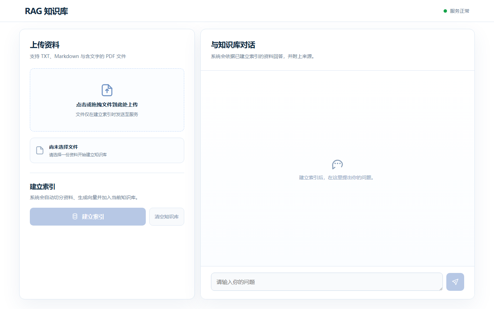
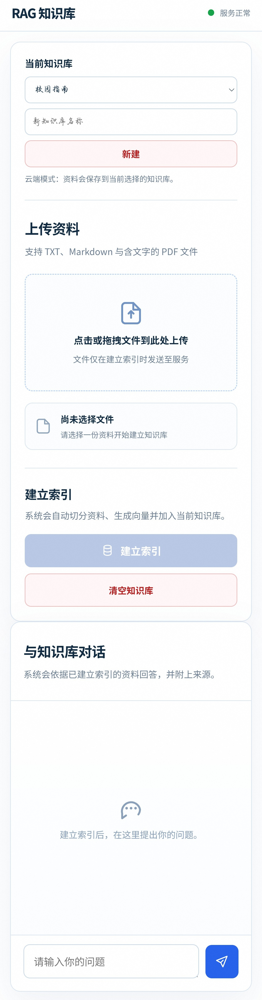
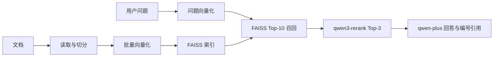

# RAG 知识库问答系统

一个可公开体验的 RAG（检索增强生成）知识库问答应用。公开 Demo 固定使用不含敏感信息的样本知识库，访客可直接提问但不能修改数据；本地或非公开环境支持上传资料并建立索引。


## 在线体验

- 在线 Demo：[rag-knowledge-base-zhqq.onrender.com](https://rag-knowledge-base-zhqq.onrender.com)
- 健康检查：[在线状态](https://rag-knowledge-base-zhqq.onrender.com/health)

> Render 免费服务闲置后会休眠，首次重新访问可能需要等待约一分钟启动。

## 界面预览

桌面端支持上传 TXT、Markdown 和含文字的 PDF，建立索引后即可在右侧对话区域提问并查看来源。



手机端会自动调整为纵向布局。



## 功能

- 上传并读取 TXT、Markdown 与含文字的 PDF 文档。
- 文本自动切分：默认每段 800 字符、重叠 100 字符。
- 调用阿里云百炼兼容接口生成文本向量。
- 使用 FAISS 进行余弦相似度检索。
- FAISS 先召回最多 10 条候选，再调用 `qwen3-rerank` 精排最多 3 条资料。
- 调用 `qwen-plus` 根据精排结果生成中文回答，并以 `[1]` 至 `[3]` 标注来源。
- 来源卡片显示文件名、从 1 开始的段落编号、相关度与命中原文摘要。
- 索引会保存在本地，服务重启时自动恢复。
- 非公开环境支持建立索引、问答和清空知识库；公开 Demo 为只读模式。
- 配置 Supabase 后，支持创建、切换多个云端知识库，并持久保存资料与向量。

## 工作流程



## 技术栈

- 后端：Python、FastAPI、Uvicorn
- 检索：FAISS、NumPy
- 云端模型：阿里云百炼兼容 API、`text-embedding-v2`、`qwen3-rerank`、`qwen-plus`
- 前端：原生 HTML、CSS、JavaScript
- 部署：Docker、Render、GitHub

## 本地运行

### 1. 克隆项目并创建虚拟环境

```powershell
git clone https://github.com/zh-qq/rag-knowledge-base.git
cd rag-knowledge-base
python -m venv .venv
.\.venv\Scripts\Activate.ps1
pip install -r requirements.txt
```

### 2. 配置云端模型

将 `.env.example` 复制为 `.env`，然后填写以下值：

```text
DASHSCOPE_API_KEY=<你的百炼 API Key>
DASHSCOPE_BASE_URL=<你的百炼兼容接口地址>
EMBEDDING_MODEL=text-embedding-v2
CHAT_MODEL=qwen-plus
DASHSCOPE_RERANK_BASE_URL=https://<你的业务空间>.cn-beijing.maas.aliyuncs.com/compatible-api/v1
RERANK_MODEL=qwen3-rerank
```

`.env` 已被 Git 忽略，禁止提交或分享。

### 3. 可选：启用 Supabase 云端知识库

1. 在 Supabase 新建免费项目。
2. 打开 SQL Editor，执行仓库中的 [`supabase/schema.sql`](supabase/schema.sql)。
3. 在 `.env` 中补充下列服务端变量：

```text
SUPABASE_URL=https://<你的项目标识>.supabase.co
SUPABASE_SECRET_KEY=<你的 Supabase Secret Key>
```

`SUPABASE_SECRET_KEY` 只能放在 FastAPI 与 Render 的环境变量中，绝不能提交到 GitHub 或写进浏览器代码。未配置这两个变量时，项目仍使用本地单知识库模式。

### 4. 公开 Demo 配置

公开部署前，先在非公开模式下创建名为 `公开演示知识库` 的云端知识库，并导入仓库中的 [`demo/campus-guide.md`](demo/campus-guide.md)。确认可正常问答后，在 Render 环境变量中设置：

```text
PUBLIC_DEMO_MODE=true
PUBLIC_DEMO_KNOWLEDGE_BASE_NAME=公开演示知识库
MAX_UPLOAD_BYTES=2097152
MAX_CHUNK_COUNT=200
MAX_QUESTION_LENGTH=1000
EMBEDDING_BATCH_SIZE=32
```

公开模式下，服务器会拒绝创建、切换、上传、预览、切分、索引和清空接口，访客无法修改 Supabase 中的公共资料。

### 5. 启动服务

```powershell
uvicorn app.main:app --reload
```

打开 `http://127.0.0.1:8000`，上传资料后即可开始提问。

## API 概览

| 接口 | 用途 |
| --- | --- |
| `GET /health` | 服务健康检查 |
| `GET /knowledge-bases` | 列出可访问知识库；公开模式仅返回样本库 |
| `POST /knowledge-bases` | 创建云端知识库；公开模式禁用 |
| `POST /knowledge-bases/{id}/select` | 切换知识库；公开模式禁用 |
| `POST /documents/preview` | 预览上传文档 |
| `POST /documents/chunks` | 查看文本切分结果 |
| `POST /documents/index` | 上传并建立知识库索引 |
| `GET /search?query=...&knowledge_base_id=...` | 检索相关文本段落；知识库 ID 可省略 |
| `POST /ask` | 基于知识库回答问题、精排并返回编号来源 |
| `DELETE /knowledge-base` | 清空当前知识库 |

## 检索效果评估

评测集位于 [`evals/retrieval-cases.json`](evals/retrieval-cases.json)，包含 10 份公开校园指南资料、25 条有答案问题和 5 条无答案问题。评测会比较“仅 FAISS”和“FAISS + Rerank”，并输出：

- `Recall@3`：预期来源出现在前 3 个结果中的问题比例。
- `MRR@3`：预期来源排名的平均倒数，越接近 1 表示越靠前。
- 逐题的 FAISS 与 Rerank 命中排名；无答案题单独列出，不计入两项指标分母。

运行真实评测会调用百炼向量与重排序接口，但不会写入本地或 Supabase 知识库：

```powershell
.\.venv\Scripts\python.exe -m app.retrieval_evaluation
```

真实评测结果会在首次配置 `qwen3-rerank` 并成功运行后填写；在此之前不预先声明效果指标。

## 测试与 CI

项目目前包含 52 项离线单元测试，测试不会发送真实文档或密钥。运行命令：

```powershell
.\.venv\Scripts\python.exe -m unittest discover -s tests -q
```

GitHub Actions 会在每次推送与 Pull Request 时，使用 Python 3.13 安装锁定依赖并运行相同测试。

## 本地知识库文件

首次建立索引后，系统会生成：

- `data/knowledge_base.faiss`：FAISS 向量索引。
- `data/chunks.json`：段落原文和来源信息。

`data/` 已被 Git 忽略，不会上传到 GitHub。网页中的“清空知识库”操作会删除这些本地索引文件。

启用 Supabase 后，文档段落和向量会保存到云端表中；切换知识库时，服务会重新构建该知识库的内存 FAISS 索引。Render 免费实例即使重启，也能从云端重新加载选中的知识库。

## Docker 与 Render 部署

项目提供 `Dockerfile` 和 `render.yaml`，可部署到支持 Docker 的云端平台。

使用 Render 免费部署：

1. 登录 [Render Blueprints](https://dashboard.render.com/blueprints)。
2. 连接 GitHub 仓库 `zh-qq/rag-knowledge-base`。
3. Render 会提示填写 `DASHSCOPE_API_KEY`、`DASHSCOPE_BASE_URL`、`EMBEDDING_MODEL`、`CHAT_MODEL`、`DASHSCOPE_RERANK_BASE_URL` 与 `RERANK_MODEL`。
4. 保持免费计划，创建服务后等待构建完成。
5. 启用 Supabase 时，设置 `SUPABASE_URL` 和 `SUPABASE_SECRET_KEY`；公开上线前按“公开 Demo 配置”填写只读模式变量。

## 当前限制

- 支持 TXT、Markdown 与含文字的 PDF；暂未支持 Word，也不支持需要 OCR 的扫描型 PDF。
- 未配置 Supabase 时，当前索引保存在服务本地；Render 免费实例重启或休眠后会丢失已上传资料。
- 已配置 Supabase 时可以持久保存多个知识库；当前仍未提供用户登录，因此线上 Demo 的知识库并非按用户隔离。
- 公开 Demo 通过只读模式保护共享样本库；如需个人或多人隔离，仍需要补充用户登录与权限设计。
